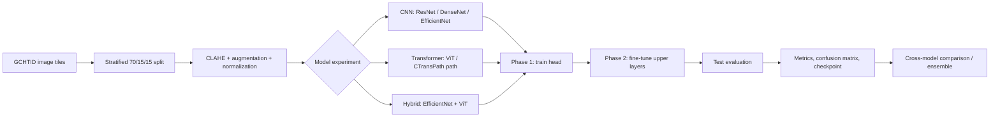

# BioFusion — Gastric Histopathology Tissue Classification


BioFusion is a research prototype for classifying H&E-stained gastric histopathology image tiles into eight tissue types. The project compares convolutional neural networks, vision transformers, a CNN–Transformer hybrid, and a histopathology-oriented model path under a shared training and evaluation pipeline.

The work was developed for a healthcare AI competition and includes the complete experimental journey: a ResNet50 baseline, architecture benchmarking, two-stage transfer learning, contrast enhancement, focal loss, attention-based feature fusion, model comparison, error analysis, saved checkpoints, inference utilities, and a technical report.

> [!IMPORTANT]
> This repository is an educational and research prototype. It is **not a medical device** and must not be used for diagnosis or clinical decision-making without independent validation, regulatory review, and qualified clinical oversight.

## Table of contents

- [Problem](#problem)
- [Dataset](#dataset)
- [What we built](#what-we-built)
- [System workflow](#system-workflow)
- [Results](#results)
- [Tech stack](#tech-stack)
- [Repository structure](#repository-structure)
- [How to run](#how-to-run)
- [Outputs](#outputs)
- [Reproducibility](#reproducibility)
- [Known limitations](#known-limitations)
- [Future work](#future-work)
- [Citation and acknowledgements](#citation-and-acknowledgements)

## Problem

Manual analysis of whole-slide histopathology images is detailed, time-consuming work. BioFusion explores whether transfer learning can help classify small tissue regions consistently and provide building blocks for downstream tumor-microenvironment analysis.

Given a `224 × 224` RGB image tile, the model predicts one of eight classes:

| Code | Tissue class | Meaning |
|---|---|---|
| `ADI` | Adipose | Fat tissue |
| `DEB` | Debris | Cellular waste/background material |
| `LYM` | Lymphocytes | Immune cells |
| `MUC` | Mucus | Mucosal secretion |
| `MUS` | Smooth muscle | Muscle tissue |
| `NOR` | Normal mucosa | Non-tumorous mucosal tissue |
| `STR` | Stroma | Connective tissue surrounding tumor |
| `TUM` | Tumor | Cancerous epithelium |

The original baseline notebook also explores spatial post-processing for neighborhood smoothing, tumor-infiltrating-lymphocyte-like regions, and tumor–stroma ratio estimation.

## Dataset

The project uses the **Gastric Cancer Histopathology Tissue Image Dataset (GCHTID)**:

- 31,096 non-overlapping H&E image tiles
- 224 × 224 pixels, RGB
- 8 tissue classes
- Derived from 300 whole-slide images from Harbin Medical University Cancer Hospital
- Stratified split used in this project: 70% train, 15% validation, 15% test
- Dataset license: CC BY 4.0

Sources:

- [Kaggle dataset](https://www.kaggle.com/datasets/orvile/gastric-cancer-histopathology-tissue-image-dataset)
- [Figshare dataset and DOI](https://doi.org/10.6084/m9.figshare.26014469.v)
- [Nature Scientific Data publication](https://www.nature.com/articles/s41597-025-04489-9)

The dataset is not committed to this repository. Download it through Kaggle or Figshare before training.

## What we built

### Model families

| Model | Role | Pretraining / design |
|---|---|---|
| ResNet50 | Initial baseline | ImageNet-pretrained CNN |
| DenseNet121 | Dense feature reuse comparison | ImageNet-pretrained CNN |
| EfficientNet-B4 | Efficient high-capacity CNN | ImageNet-pretrained CNN |
| ViT-Base | Transformer comparison | `vit_base_patch16_224`, ImageNet pretrained |
| Hybrid ensemble | Complementary local + global features | EfficientNet-B4 + ViT-Base with learned attention fusion |
| CTransPath path | Domain-specific transfer-learning experiment | Attempts CTransPath; falls back to ConvNeXt-Base or ViT when unavailable |

### Training and analysis features

- Shared dataset loading, deterministic splitting, transforms, training, and evaluation code
- Two-phase transfer learning:
  1. freeze the pretrained backbone and train the classification head;
  2. unfreeze selected upper layers and fine-tune with a lower learning rate
- CLAHE contrast enhancement in LAB color space
- Horizontal/vertical flips, small rotations, and subtle color jitter
- ImageNet channel normalization
- Focal loss with label smoothing for hard examples
- AdamW optimization, weight decay, learning-rate scheduling, and early stopping
- Attention-based fusion for CNN and transformer feature branches
- Accuracy, macro/weighted F1, Matthews correlation coefficient, per-class F1, classification reports, and confusion matrices
- Training curves, feature-space/t-SNE analysis, checkpoint saving, and multi-model comparison
- Optional stain-normalization experiments and utilities
- Google Drive checkpoint persistence for Colab sessions

## System workflow



## Results

The following values are completed, documented experiments in the notebooks and analysis files. They should not be interpreted as external or clinical validation.

| Experiment | Test accuracy | Macro F1 | Notes |
|---|---:|---:|---|
| ResNet50 | 60.84% | 0.6022 | Baseline result used in the consolidated comparison |
| DenseNet121 | 61.52% | 0.6071 | CNN benchmark |
| EfficientNet-B4 | 65.92% | 0.6548 | Strongest single CNN among the initial four models |
| ViT-Base | 67.44% | 0.6713 | Best initial single architecture |
| Hybrid EfficientNet-B4 + ViT | 69.43% | 0.6940 | Attention-based feature fusion; MCC 0.6508 |
| CTransPath experiment — ConvNeXt fallback | 73.74% | — | The run loaded ConvNeXt-Base rather than verified CTransPath weights |

Key observations:

- Transformer and hybrid representations improved on the ResNet50 baseline.
- The hybrid model was strongest on adipose and lymphocyte tiles (`F1 ≈ 0.805` and `0.802`).
- Normal mucosa, debris, stroma, and tumor remain more difficult because of overlapping morphology.
- Normal-versus-tumor and mucus-versus-adipose errors are especially important targets for future improvement.

Some older planning documents contain projected accuracy ranges. Those are hypotheses, not measured results; the table above reports completed experiments only.

## Tech stack

| Area | Tools |
|---|---|
| Language and runtime | Python, Jupyter Notebook, Google Colab |
| Deep learning | PyTorch, TorchVision, `timm`, `efficientnet-pytorch`, Transformers |
| Data and imaging | NumPy, Pillow, OpenCV |
| Evaluation | scikit-learn |
| Visualization | Matplotlib, Seaborn, t-SNE |
| Data access and storage | Kaggle API, Google Drive |
| Optional histopathology preprocessing | `torchstain` |

## Repository structure

```text
BioFusion/
├── model.ipynb                       # Original ResNet50 + spatial-logic study
├── ModelCtranspath.ipynb             # CTransPath/ConvNeXt experiment notebook
├── ModelConvext.ipynb                # ConvNeXt experiment notebook
├── Model ensemble.ipynb              # Hybrid EfficientNet + ViT notebook
├── Bio fusion vit model/
│   ├── VIT model.ipynb               # Improved ViT experiment
│   ├── VIT_model_colab.py            # Colab-oriented ViT workflow
│   └── shared_utilities.py
├── shared_utilities.py               # Shared data, training, metrics, plots, saving
├── model_resnet50.py                 # ResNet50 training workflow
├── model_densenet.py                 # DenseNet121 training workflow
├── model_efficientnet.py             # EfficientNet-B4 training workflow
├── model_uni.py                      # UNI-style path using ViT-Base fallback
├── model_ensemble_hybrid.py          # Attention-fusion hybrid workflow
├── model_ctranspath.py               # CTransPath path with explicit fallbacks
├── compare_models.py                 # Compare saved JSON result files
├── ensemble_models.py                # Soft-voting checkpoint ensemble
├── evaluate_saved_ctranspath.py      # Restore and evaluate saved experiment
├── inference_notebook_template.ipynb # Single-image inference template
├── improvements_implementation.py    # Stain normalization / focal-loss experiments
├── InsightAi_Report.pdf              # Competition technical report
└── *.md                              # Experiment notes and setup guides
```

Model checkpoints are kept outside Git because of their size; the local `.pt` files are ignored by default.

## How to run

### Recommended: Google Colab notebooks

A CUDA-enabled Colab runtime is the intended execution environment. The root-level `model_*.py` files include Colab commands such as `!pip`, `!kaggle`, and `files.upload()`; they are notebook-style scripts and are **not directly executable by a standard Python interpreter without removing those cells/lines**.

#### 1. Clone the repository

```bash
git clone https://github.com/Oxshadha/Bio-Fusion.git
cd Bio-Fusion
```

Alternatively, upload the selected notebook and `shared_utilities.py` directly to Colab.

#### 2. Enable a GPU

In Colab, choose **Runtime → Change runtime type → T4 GPU** (or another available CUDA GPU).

#### 3. Configure Kaggle access

Download `kaggle.json` from **Kaggle → Account → API → Create New Token**, then upload it only to the active Colab session.

> [!CAUTION]
> Never commit `kaggle.json`, API tokens, patient data, or Google Drive credentials to GitHub.

Run in a Colab cell:

```python
from google.colab import files
files.upload()  # select kaggle.json
```

```bash
!mkdir -p ~/.kaggle
!cp kaggle.json ~/.kaggle/
!chmod 600 ~/.kaggle/kaggle.json
!kaggle datasets download -d orvile/gastric-cancer-histopathology-tissue-image-dataset
!unzip -q gastric-cancer-histopathology-tissue-image-dataset.zip -d /content/GCHTID
```

The shared configuration expects:

```text
/content/GCHTID/HMU-GC-HE-30K/all_image/
├── ADI/
├── DEB/
├── LYM/
├── MUC/
├── MUS/
├── NOR/
├── STR/
└── TUM/
```

#### 4. Install dependencies

For the common workflows:

```bash
!pip install -q torch torchvision timm efficientnet-pytorch transformers \
    opencv-python scikit-learn matplotlib seaborn kaggle
```

For optional stain normalization:

```bash
!pip install -q torchstain
```

The CTransPath path may also try to install its upstream repository. If it cannot load CTransPath, the current implementation reports the fallback architecture it actually uses.

#### 5. Choose and run an experiment

For the most complete, presentation-ready workflows, open one of:

- `ModelCtranspath.ipynb`
- `Model ensemble.ipynb`
- `ModelConvext.ipynb`
- `Bio fusion vit model/VIT model.ipynb`
- `model.ipynb` for the original baseline and spatial analysis

Run all cells from top to bottom. The workflows download/load the data, build the stratified splits, train in two phases, restore the best validation checkpoint, evaluate the test split, and save metrics and visualizations.

For a model-specific Colab script, upload `shared_utilities.py` and the corresponding `model_*.py`, paste/run the script as notebook cells, and follow its upload prompts.

### Compare trained models

Collect any available result files in the repository root:

```text
resnet50_results.json
efficientnet_results.json
densenet_results.json
uni_results.json
hybrid_results.json
ctranspath_results.json
```

Then run in an environment where the dependencies are installed:

```bash
python compare_models.py
```

Missing result files are skipped. The command generates `model_comparison.png` and `per_class_f1_comparison.png` and prints the best available model.

### Run inference

Open `inference_notebook_template.ipynb`, update the checkpoint path and model definition to match the trained architecture, then run the cells to classify a single image. A checkpoint must be loaded into the exact architecture that produced it.

## Outputs

A completed training workflow can create:

| Output | Purpose |
|---|---|
| `<model>_final.pt` | Best/final PyTorch state dictionary |
| `<model>_results.json` | Accuracy, macro F1, weighted F1, MCC, per-class F1 |
| `<model>_cm.png` | Confusion matrix |
| `model_comparison.png` | Overall model comparison |
| `per_class_f1_comparison.png` | Per-class F1 comparison |
| training-history plots | Train/validation loss and accuracy |

When Google Drive is mounted, checkpoints and result JSON files are also saved under `/content/drive/MyDrive/BioFusion_Models`.

## Reproducibility

- Random seed: `42` for Python, NumPy, and PyTorch
- Stratified train/validation/test split: `70/15/15`
- Default batch size: `32` (reduce to `16` if the hybrid model exceeds GPU memory)
- Shared class order: `ADI, DEB, LYM, MUC, MUS, NOR, STR, TUM`
- Default initial workflows: 10 epochs for head training + 10 epochs for fine-tuning
- Improved hybrid/CTransPath workflows use longer schedules, stricter overfitting checks, and cosine annealing
- Best checkpoints are selected using validation loss before test evaluation

GPU type, package versions, availability of pretrained weights, and whether the CTransPath fallback is triggered can affect the result. Record these details when reproducing an experiment.

## Known limitations

- The data originates from a single institution, so cross-site and cross-scanner generalization is unknown.
- Evaluation is tile-level rather than patient-level external validation.
- Morphologically similar classes still produce clinically important confusions, particularly `NOR ↔ TUM`.
- CLAHE is active, while stain normalization is optional and not consistently applied across every completed experiment.
- Several scripts depend on Colab-specific commands and paths.
- The CTransPath workflow must not be described as CTransPath unless its architecture and pretrained weights were successfully loaded; the strongest documented run used ConvNeXt-Base fallback.
- The current repository does not establish a software license for the project code. Add one before inviting reuse or contributions.

## Future work

- Validate on external hospitals, scanners, and staining protocols
- Use patient/slide-grouped splitting to further reduce leakage risk
- Verify and benchmark official CTransPath weights against ConvNeXt
- Apply Macenko or Vahadane stain normalization consistently
- Add calibration, uncertainty estimation, and abstention for ambiguous tiles
- Tune hard-example sampling and class-pair-aware losses
- Evaluate patient-level and whole-slide aggregation
- Add automated tests, a pinned dependency file, and a clean command-line training interface
- Export the selected model for a controlled inference service after clinical validation

## GitHub publishing notes

Before pushing the project publicly:

1. Add a code license that matches the team's intended reuse policy.
2. Use [Git LFS](https://git-lfs.com/) or a release/model registry for `.pt` checkpoints. The local weights are large and ordinary Git history is not ideal for model artifacts.
3. Keep datasets, downloaded archives, credentials, generated plots, and local notebook checkpoints excluded through `.gitignore`.
4. Clear notebook outputs if they contain tokens, mounted Drive paths, personal information, or unnecessary large logs.
5. Report the exact loaded backbone and package versions with every published result.

## Citation and acknowledgements

If you use the dataset, cite its creators:

```bibtex
@dataset{lou2024gchtid,
  author    = {Lou, Shenghan and Ji, Jianxin and Zhang, Xuan and Li, Huiying and
               Jiang, Yang and Hua, Menglei and Chen, Kexin and Zheng, Xiaohan and
               Zhang, Qi and Han, Peng and Cao, Lei and Wang, Liuying},
  title     = {Gastric Cancer Histopathology Tissue Image Dataset (GCHTID)},
  year      = {2024},
  publisher = {figshare},
  doi       = {10.6084/m9.figshare.26014469.v}
}
```

This project builds on PyTorch, TorchVision, `timm`, EfficientNet, Vision Transformer, ConvNeXt, CTransPath research, scikit-learn, OpenCV, and the GCHTID dataset authors. See the included notebooks and report for the full experimental discussion and research references.
